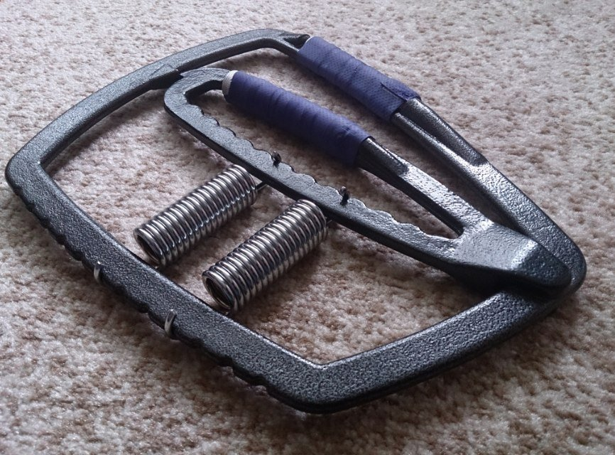

Последние пять лет для тренировки предплечий использовал резиновый эспандер. Такое зеленое кольцо, которое сжимается только за счет среднего и безымянного пальцев. С какой силой его нужно сдавливать — 35, 45 килограмм? Дело дошло до того, что я начал регулярно сжимать его по 100 с лишним раз, а этих нагрузок он перенести не смог и порвался.

Упругости эспандера я не знал, а смотреть без него фильмы по вечерам стало скучно, поэтому начал искать себе аналог «на вырост» с регулируемой нагрузкой. Пару дней на чтение обзоров, просмотр отзывов на YouTube и мой выбор пал на Arm Hand Gripper. На AliExpress’е он без названия, но это копия CFF Pit Bull Super Vise Gripper, Hammar Vice Gripper и Ivanko Super Gripper.

Эспандер

У меня в комплекте две пружины, начинал с положения 2—4 — это где-то 64 фунта или 29 килограмм. За 14 дней тренировок дошел до 4—7 (почти 59 кг). А вот чтобы сжать две пружины в максимальном положении придется преодолеть сопротивление в 156 килограмм.

Простота регулирования позволяет тренировать хоть каждый палец по отдельности — достаточно оттянуть подвижную часть и сместить или снять пружины. Из недостатков только мозоли от резкой нагрузки и больше ничего. Очень крутая штука, которой буду пользоваться много лет.
