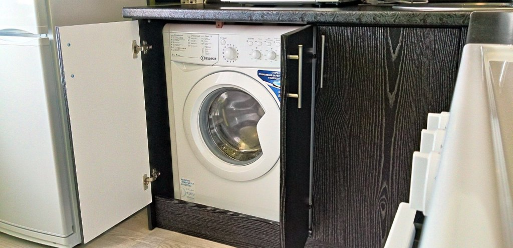

В ванне мало места под стиральную машину, заказал угловой гарнитур на кухню и вставил в шкафчик. Вроде дело не сложное, но пришлось столкнуться с интересными моментами.

На что нужно обратить внимание:

- Высота большинства стиральных машин 85 сантиметров. Чтобы не билась об столешницу нужен зазор в 1 см. Получается расстояние от пола до нижней части столешницы — 86 сантиметров. Сэкономите 2-3 сантиметра купив стиралку со съемной верхней крышкой.
- Рассчитывая глубину смотрите на машинку: если сзади на крышке козырёк, то шланги для воды будут под ним и хватит зазора 1-2 см от стены. Без козырька нужен запас около 5 см. Если стиралка будет в узком шкафу закрываться дверками, то учитывайте что она будет расположена за петлями — тут зависит от вида петель, это где-то ещё 5 см глубины.
- Ширина места под стиралку должна быть больше машинки на 1-2 сантиметра с каждого края чтобы при отжиме вибрацией не разнесло гарнитур. Опять же, если будут дверки учитывайте что петли тоже занимают место. Стиралку шириной в 60 сантиметров не вставите в шкаф шириной 62 сантиметра с дверками — упрётесь в петли. Либо делать шкаф шире, либо глубже и ставить за петлями.
- Если стиральная машинка будет закрываться дверками, то у неё должен быть длинный лоток под порошок. С коротким неудобно насыпать, придётся пользоваться ложкой.
- Смотрите где расположена розетка. Часто она в стороне от кухонного гарнитура, а шкафы плотно прилегают к стенам и места чтобы просунуть кабель с вилкой просто нет. Тут или переносить розетку, или выпиливать участок в гарнитуре.
