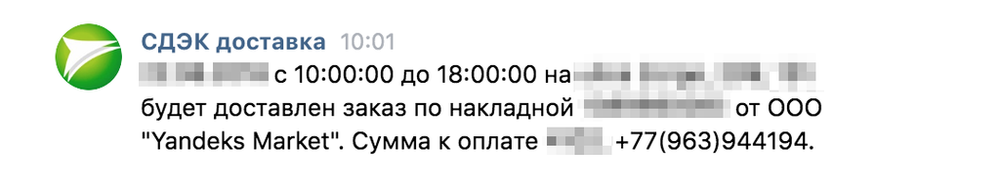
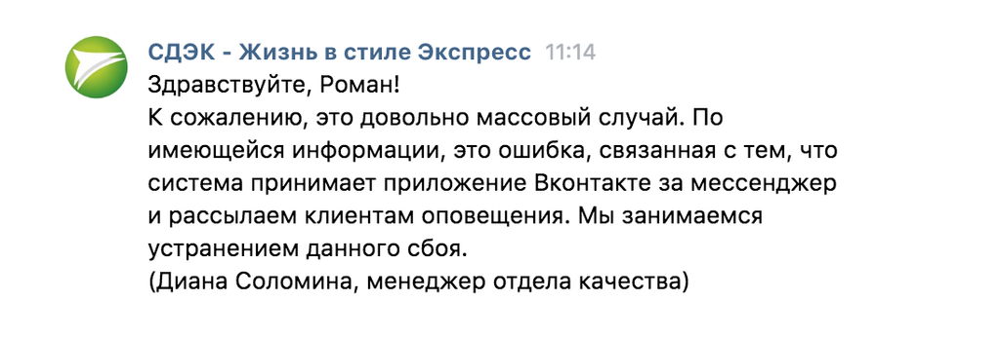

Довелось получать посылку отправленную через СДЭК. В день доставки неожиданно получил уведомление от них в ВКонтакте. Я не помню чтобы где-то указывал свой профиль, только почту и номер телефона.

Пишу вопрос в службу поддержки, в ответ какая-то мутная отмазка про мессенджер. Причем тут он, если вы как-то сопоставили мои контактные данные и профиль.

Оказалось, что у ВКонтакте есть такая услуга — [Сообщения от доверенных сообществ](https://vk.me/products/notify/). Если номер телефона указанный при заказе товара совпадает с номером в профиле, то вам могут прислать сообщение.

Идея хорошая, но не реализация — в корзине интернет-магазинов должен быть пункт что я согласен получить уведомления от СДЭК через социальные сети. Без явного согласия делать рассылку нельзя: у вас два способа связи на которые я согласился — телефон и почта. Пытаясь найти третий способ вы не уважаете клиента и даже можете подставить: его профиль может быть угнан и сообщение получит мошенник, его профиль используется в рабочих целях и сообщение увидят несколько человек, его посылка может быть подарком и случайно появившееся уведомление раскроет все планы.

Отключается этот навязчивый сервис на странице [приватности](https://vk.com/settings?act=privacy) ВКонтакте, пункт в конце списка — «Компании могут посылать мне сообщения по номеру телефона».
