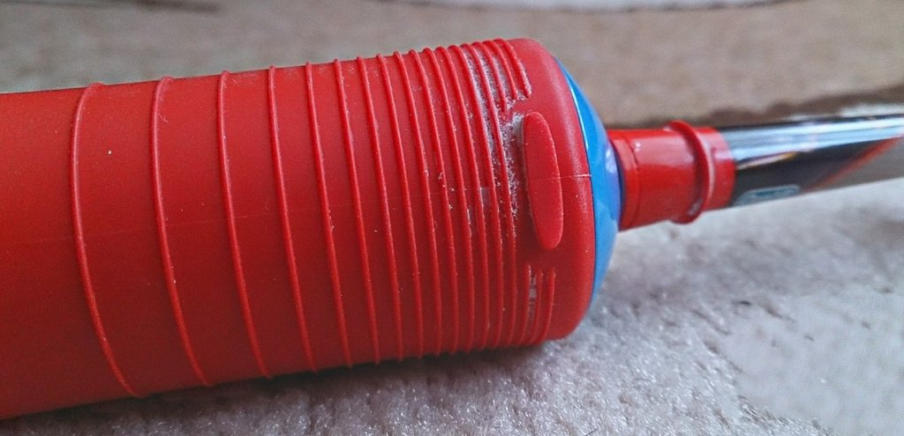

Лучше вообще её не делать, чем делать не думая. На зубной щётке, которую купил в прошлом году, есть ребристая поверхность. Вот зачем она там? Если бы даже была тупо гладкой, то всё равно ручка не скользила бы. Но нет:

Получайте лишнюю работу. Теперь после каждой чистки нужно отдельно промывать ручку, иначе в «складках» остаётся засохшая паста. Проблема на ровном месте, когда вместо практичности погнались за красотой.
