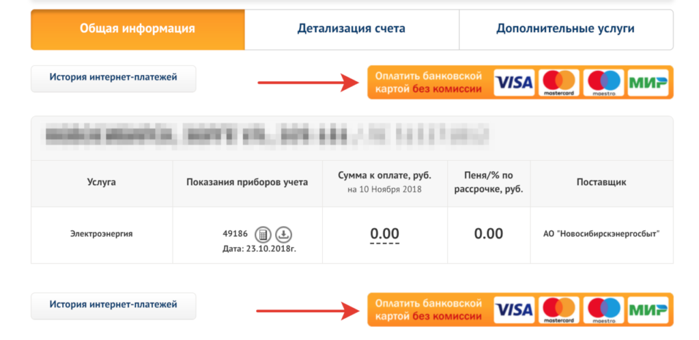

Каждый месяц для передачи показаний пользуюсь системой «Сервис-Население» от Новосибирскэнергосбыта. И каждый месяц не могу с первого раза оплатить выставленный счёт. Дело в не в технических проблемах — я просто не вижу кнопку.

Зачем-то их две. Может быть, не я один их не вижу и решили продублировать? В любом случае, они настолько яркие и отличаются внешним видом от кнопок «История интернет-платежей», что распознаются как рекламные баннеры и отфильтровываются. Это как если бы на входе в магазин поставили две двери, одна из которых люк от подводной лодки: покупатели будут игнорировать его и пользоваться обычной.
