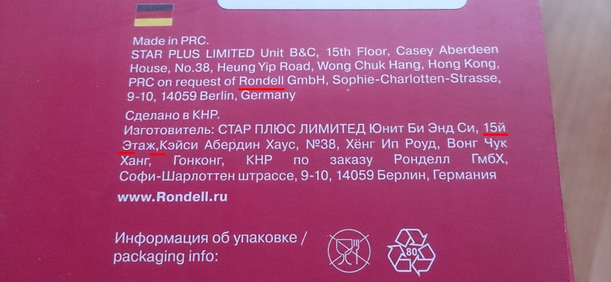
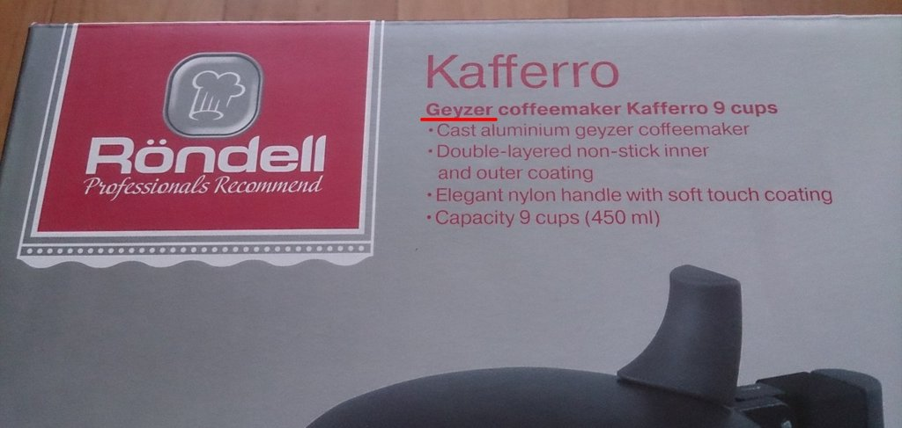
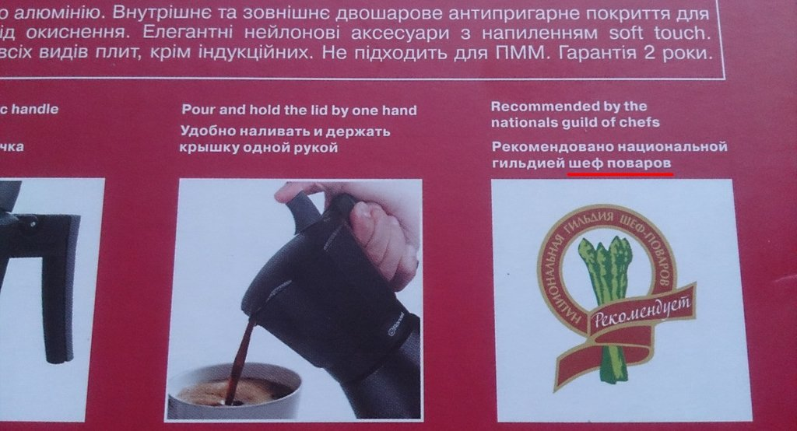

Купил себе кофеварку от Röndell. Несмотря на довольно бюджетную стоимость на удивление отличные товары, ну да не об этом. Бренд рекламируется как немецкий, но всё равно видны русские корни.

Смотрим на верхнюю часть упаковки. Röndell написано как Rondell — точечки, то есть умлаут, потеряли. Спишем на то, что здесь английский язык и они редко используются. Зато дальше набор русскоязычных ошибок: «15й» вместо «15-й», «Этаж» с заглавной буквы и пропущенный пробел после запятой.

Поворачиваем коробку лицевой часть и видим Geyzer вместо Geyser. Вот это прям ошибка так ошибка для «иностранца».

Поворачиваем задней частью — «шеф поваров», потеряли дефис.

