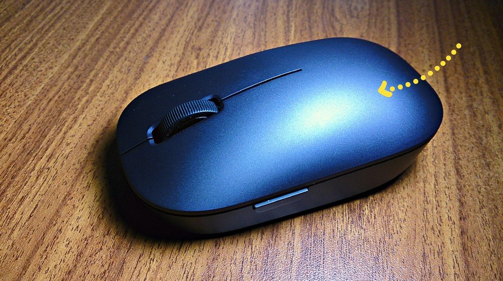
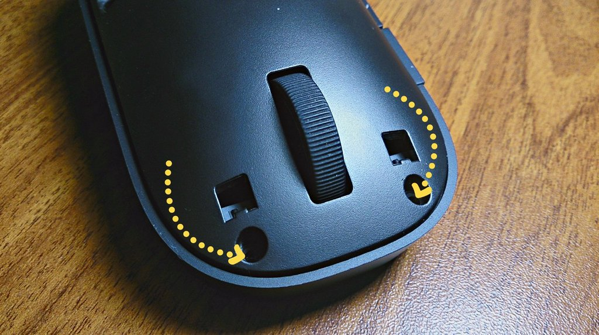
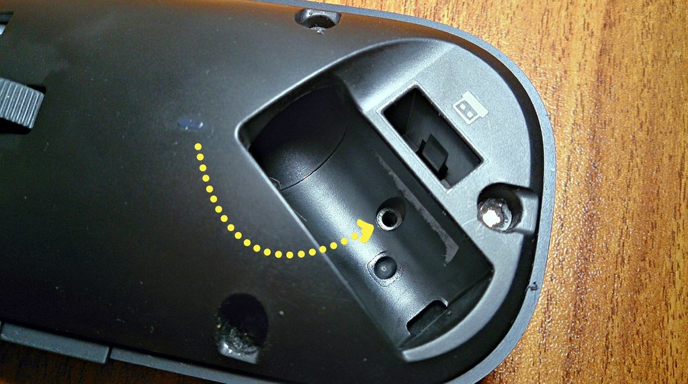
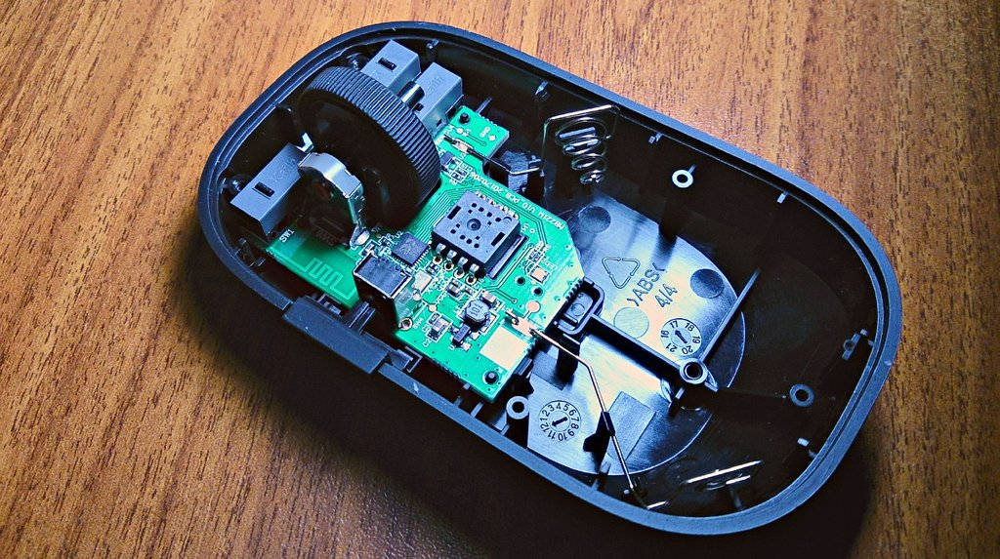

Она же WSB01TM. Далеко не сразу получилось разобраться как это сделать, решил поделиться.

Сначала снимаем верхнюю крышку, она держится на магнитах. Просто поднимайте её заднюю часть:

В передней части есть два отверстия. Они залиты пластмассой, это такой способ чтобы было видно вскрывали мышь или нет. Берите крестовую отвертку, протыкайте слой и откручивайте винты:

Теперь вытаскивайте батарейку и отдирайте наклейку — там последний винт:

Держитесь за отсек для батареек и аккуратно поднимайте внутреннюю крышку. Для доступа ко внутренностям больше нет препятствий:

