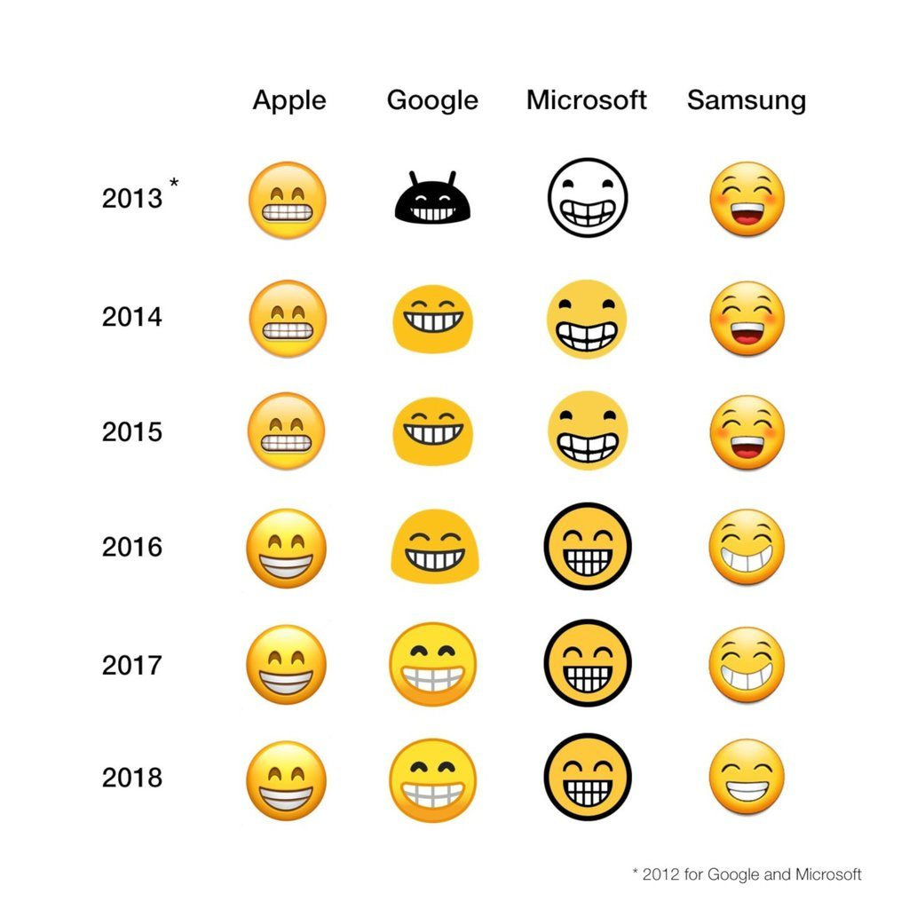

Я не очень понимаю чем руководствуются дизайнеры, но с эмодзи улыбки происходит что-то странное. Вот как она менялась за последние 5 лет:

У Apple сразу ориентир на Гарольда скрывающего боль. В Google почему-то решили, что пользователь не ассоциирует изображение с собой и своими эмоциями воткнув андроида. У Microsoft черно-бело изображение. Ну камон, я ещё в 2004 году цветными смайлами-колобками пользовался. А тут кроме цвета ещё и зубы сжатые при улыбке. У Samsung идеально — изогнутые разрезы глаз и брови, щёки, обнаженные верхние зубы и виден язык. Следующие два года Microsoft раскрашивает картинку, а Google делает её больше похожей на человека.

В 2016 году всё пошло наперекосяк. Сжатые от боли зубы Apple становятся губами Гомера Симпсона. В Google решают сделать шею эмодзи шире головы. Microsoft добавляет смещение средней линии зубного ряда. Samsung забивает рот подушечками Stimorol.

В последние два года Google возвращает круглую голову, но рисует сомкнутые челюсти. Samsung добавляет аномалию слившихся зубов.

Что нас ждёт в 2019 году? Нужно экспериментировать с глазами. Хватит уже этих дуг бровей, пора добавлять зрачки. И чтобы они постоянно вращались.
