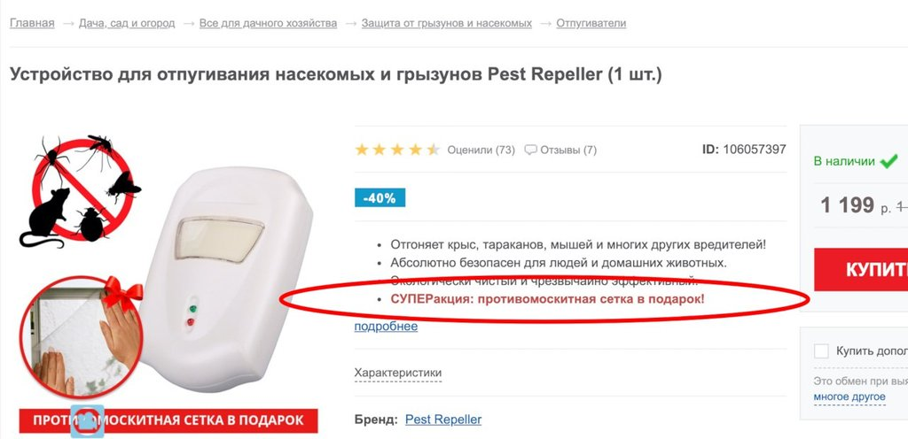

Я понимаю, когда продавая товары предлагают купить сопутствующие. Типа, покупаешь смартфон — возьми чехол и защитную плёнку. Они полезные. Но вчера, листая каналы по телевизору, наткнулся на интересный пример рекламы: закажите отпугиватель насекомых и получите противомоскитную сетку в подарок. Думал показалось, полез на официальный сайт:

Зачем сетка, если вы отпугиватель продаёте? Не помню чтобы ещё когда-то видел подарок, который сам за себя говорит что основной товар плохо работает.
