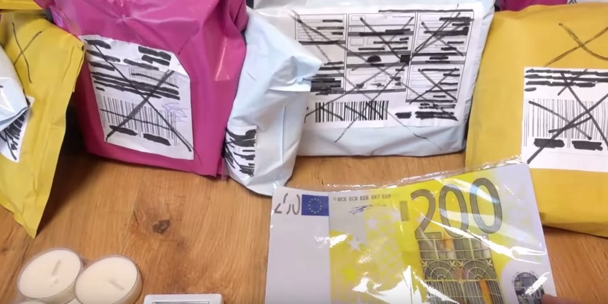
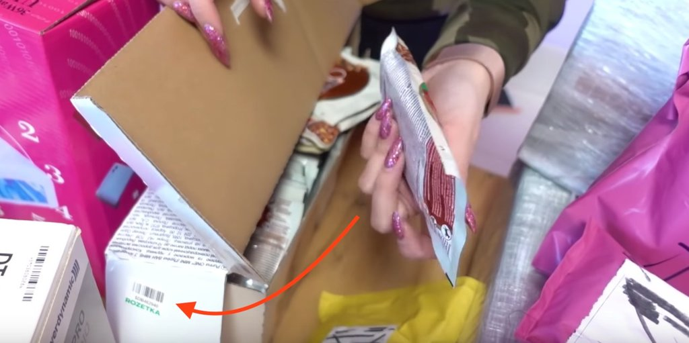
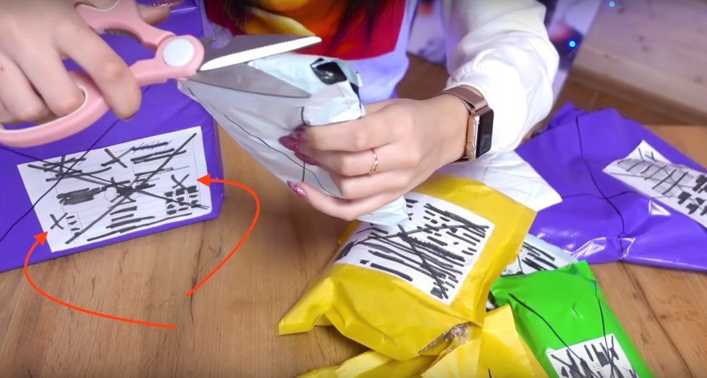

Ютуб завалило роликами на эту тему. Весёлое шоу, жалко что от реальности там мало. Начнём с того, что информация на упаковках спрятана. Как говорят обзорщики, они к ним приходят уже в таком виде. Значит замазывают поставщики. На фото видно, что шрих-код зачеркнут маркером который просвечивает. Тогда какой смысл в такой маскировке? Почему просто не срывать упаковку чтобы наверняка?

Ой, кто-то забыл что номер посылки кроме упаковки бывает ещё и внутри. Странные поставщики, которые не знают об этом.

Там номер не затёрли, зато тут нарисовали лишних крестов на пустом пространстве:

Если посмотреть ролики, то среди посылок за 100$ встречаются и Айфоны, цена которых 900$. Почему поставщик разбрасывается такими деньгами? Ведь может за 15 000 руб. нанять студента который весь месяц будет вскрывать и сортировать товары для дальнейшей продажи по полной цене на досках объявлений.

Если бы все эти посылки были настоящие, то такой бизнес если и не чёрный, то точно серый. Ведь обычно посылки или отправляются обратно продавцу, или спустя какое-то время утилизируются. Предположим, что обзорщики об этом не знают и крайним остаётся только поставщик. Тогда вопрос: что у него в голове, если он продаёт нелегальный товар людям, которые рассказывают о нём за лайки миллионам подписчиков?
