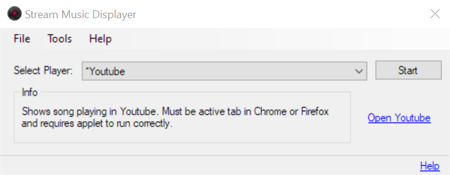
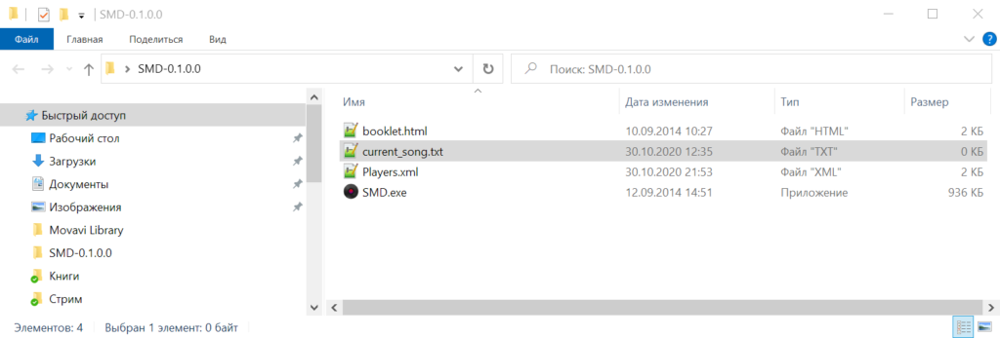
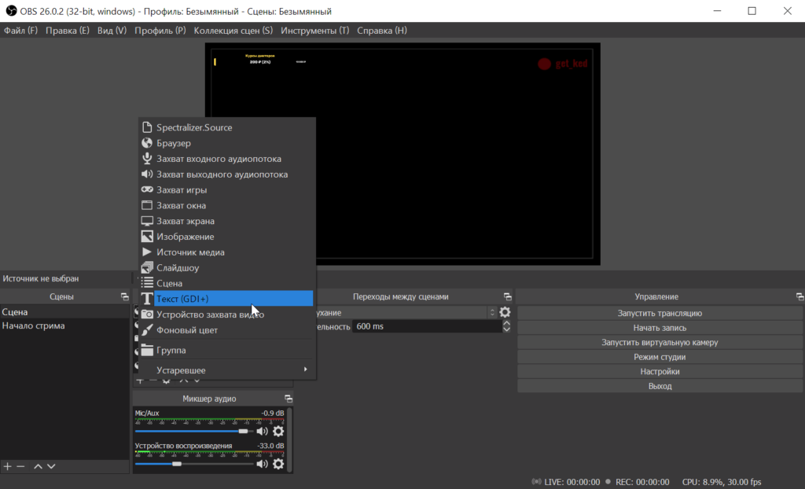
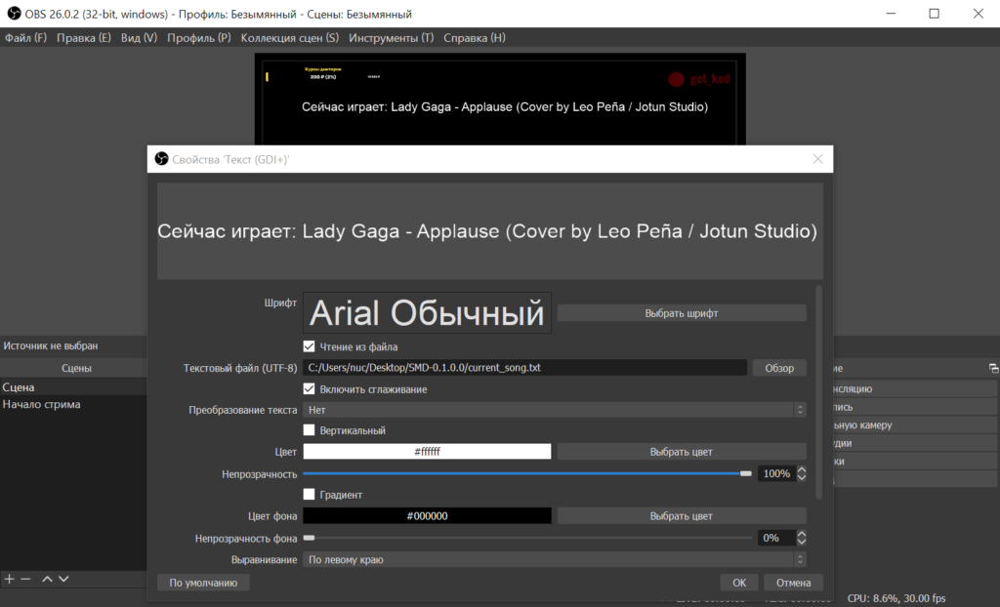
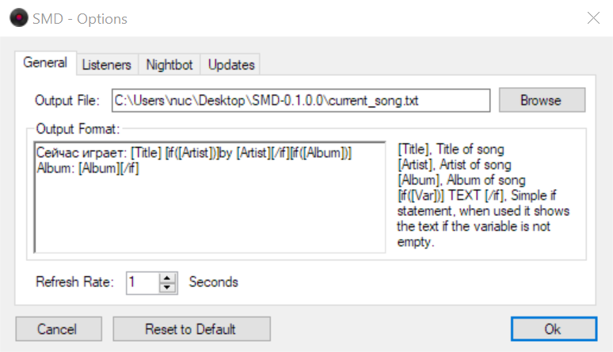

Есть трансляция, есть желание отображать на экране играющую сейчас песню. Погнали.

Скачайте архив с [Stream Music Displayer](https://obsproject.com/forum/resources/stream-music-displayer.107/), разархивируйте и запустите.

В выпадающем списке Select Player выбираем плеер или нужный сервис. Например, можно отображать песню из открытой в браузере вкладки YouTube (работает в Firefox и Chrome). После выбора нажимаем Start.

Запускайте нужную вам песню или видео, если всё сделано правильно в разархивированной папке появится файл с названием current\_song.txt

Теперь запустите OBS и в источниках добавьте Текст (GDI+). Если у вас OBS от СтримЛабса, то найдите похожий пункт.

В настройках выберите текстовый файл current\_song.txt, нужный цвет и размер шрифта.

Если вам не нравится формат надписи выводимого трека или хочется перевести слова, то можно в Stream Music Displayer перейти в меню Tools - Options и на вкладке Generals сделать по-своему:

Чтобы сбавить нагрузку на CPU поставьте Refresh Rate равным 5 секунд.

А ещё можете подписаться на мой канал [get\_ked](https://www.twitch.tv/get_ked): детективные/логические/тактические игрушки и иногда озвучка комиксов.
