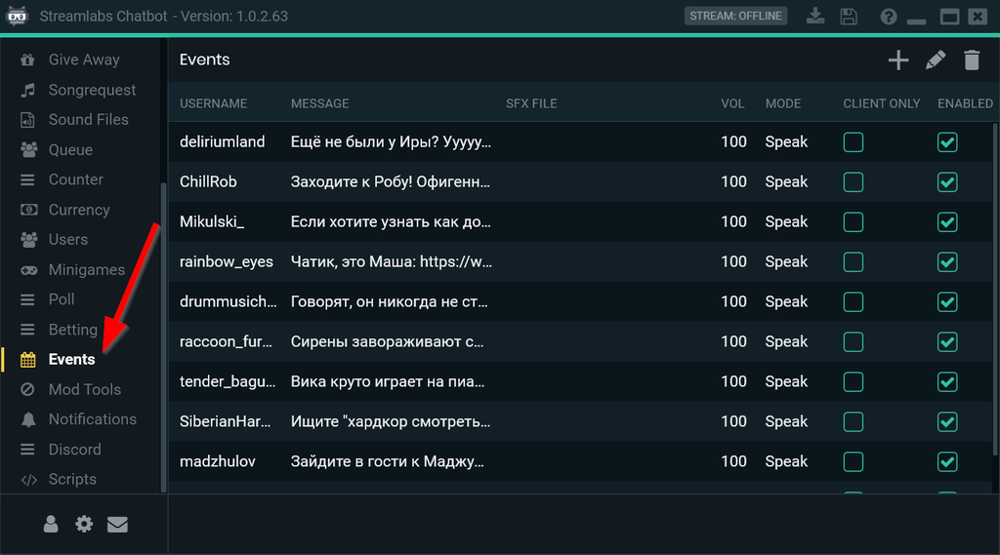
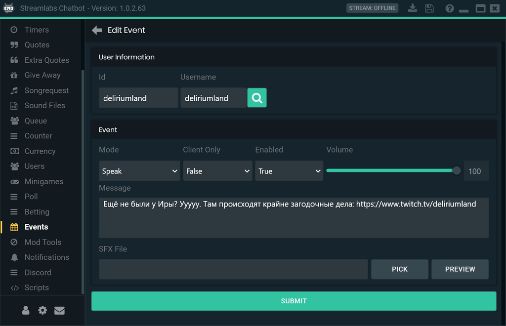

Я тут потихоньку обживаюсь на Твиче, смотрю какие есть интересные штуки. Одна из них - делать "шаталку" (шатаут, shoutout) - сообщение в чате с упоминанием пользователя и рекомендацией зайти к нему на канал. Вот как её можно делать автоматически через [Streamlabs Chatbot](https://streamlabs.com/chatbot). Ставим, запускаем, авторизуемся, переходим на вкладку Events:

В правой верхней части окна нажимаем на + и начинаем заполнять. В Username указываем логин рекомендуемого пользователя и нажимаем лупу - логин добавится в поле id. 

Если нужно чтобы шаталка была когда пользователь что-то написал в чате, то выбирайте Mode - Speak. Если нужно даже когда просто зашёл на трансляцию, то Mode - Join.

Client Only - True - сообщение увидит только сам пользователь. Client Only - False - сообщение увидят все зрители.

В выпадающем списке Enable пункт True включает шаталку, False - выключает.

Ну и в Message вписываем сам текст, который бот будет отправлять в чат.
