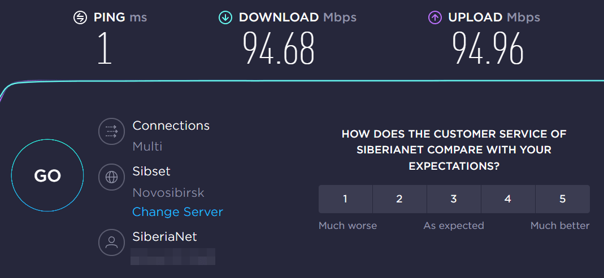
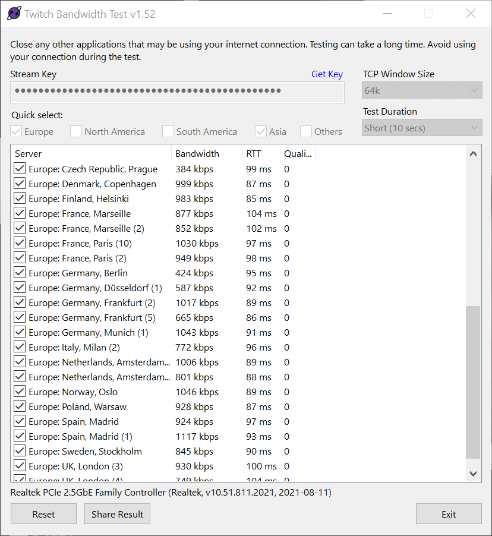
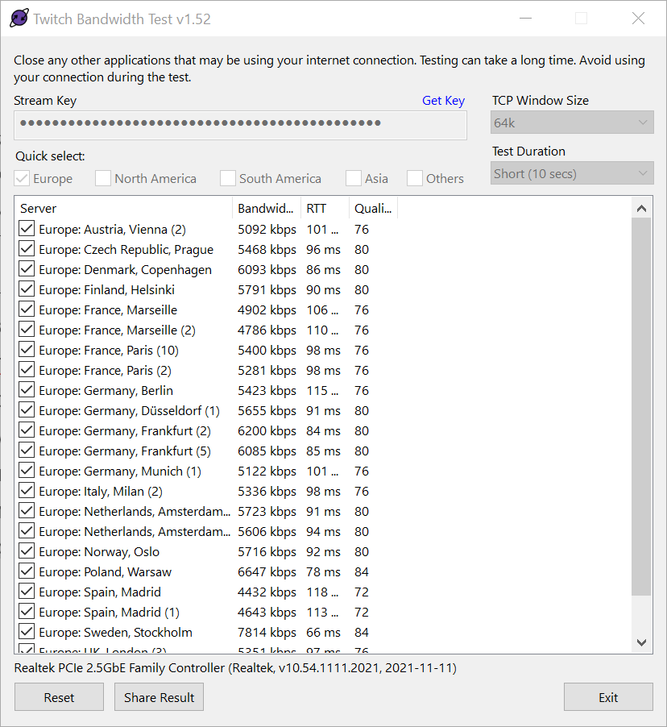

Последние две недели я не мог стримить из-за постоянных замираний изображения. У других стримеров из России такого не было. Чтобы спросить провайдера "почему так?" нужно было убедиться, что проблемы где-то на его стороне, а не у меня.

Результаты тестов скорости показали, что внутри города она вполне заявленная тарифом.

Результаты с speedtest.net

Значит моё оборудование справляется. У Твича нет серверов в России и тут я уже хотел запустить много-много проверок скорости до Европы, но решил поискать как это автоматизировать. И нашёл Twitch Bandwidth Test (можете скачать с [моего](/wp-content/uploads/2022/02/twitchtest-1.52.zip) сервера или с [официального](https://r1ch.net/projects/twitchtest)).

Вот такие были результаты

Настройки позволяют выбрать как отдельные города, так и сразу регион с серверами. Или указать свой Stream Key, хотя и зашитый полностью рабочий. Или выбрать TCP Windows Size и продолжительность теста, но это уже гиковские настройки - и со стандартными значениями всё должно работать.

Как видно по скриншоту, скорость в районе мегабита. Это максимум качество в 360p, что крайне мало. Попереписывался с провайдером, получил ответ "скорость в другие города, тем более страны не гарантируется" и всё. Стал задумываться о смене провайдера, а проснувшись утром обнаружил, что интернета нет вообще. Вызвал саппорт, пообещали инженера на следующий день. А на этот следующий день оказалось, что интернет появился сам по себе, как и появился нормальный битрейт.

А вот результаты с нормальным битрейтом

На несколько серверов можно отдавать картинку с битрейтом в 6 мегабит, а это официальный максимум для Твича. Было это совпадением, или провайдер нашёл косяк и втихую исправил, останется загадкой.
